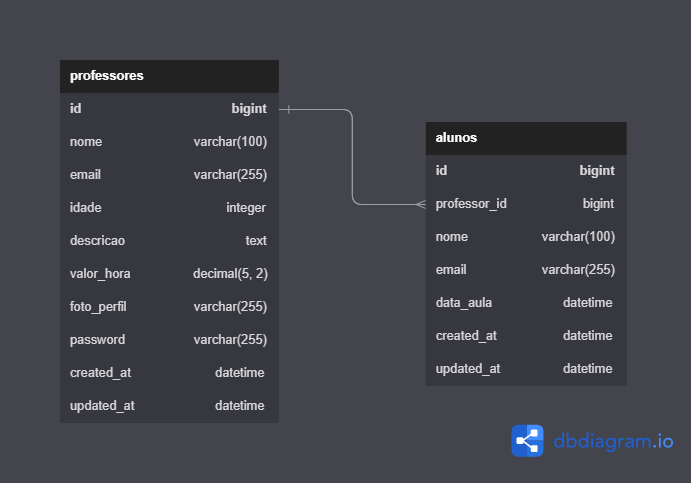

# Desafio: HyperProf

  

  HyperProf by <a href="https://github.com/CleysonPH">CleysonPH</a>

  API para gerenciamento de professores e aulas particulares

## índice

- [Descrição](#descrição)
- [Rotas](#rotas)
- [Diagrama Banco de Dados](#diagrama-banco-de-dados)
- [Requisitos](#requisitos)
- [Casos de Uso](#casos-de-uso)

## Descrição

Seu desafio é criar uma API para gerenciar professores e aulas particulares. A API deve permitir que professores se cadastrem e sejam listados, além de permitir que alunos busquem professores por descrição.

## Rotas

| Rota                                   | Método | Descrição                                         | Requer Autenticação |
| -------------------------------------- | ------ | ------------------------------------------------- | ------------------- |
| /api/professores                       | GET    | Lista os professores                              | Não                 |
| /api/professores/{professor_id}        | GET    | Detalhes do professor                             | Não                 |
| /api/professores/{professor_id}/alunos | POST   | Cadastra uma solicitação de aula                  | Não                 |
| /api/professores                       | POST   | Cadastra um professor                             | Não                 |
| /api/professores                       | PUT    | Atualiza os dados do professor logado             | Sim                 |
| /api/professores/foto                  | POST   | Atualiza a foto de um professor                   | Sim                 |
| /api/professores/alunos                | GET    | Lista as solicitações de aula do professor logado | Sim                 |
| /api/professores                       | DELETE | Exclui o professor logado                         | Sim                 |
| /api/auth/login                        | POST   | Faz login                                         | Não                 |
| /api/auth/refresh                      | POST   | Atualiza o token de acesso                        | Não                 |
| /api/auth/logout                       | POST   | Faz logout                                        | Sim                 |

## Diagrama Banco de Dados

A aplicação terá duas tabelas que irão se relacionar entre si, sendo elas a tabela `professores` e a tabela `alunos`.

## Requisitos

- [Funcionais](requisitos/funcionais.md)
- [Não Funcionais](requisitos/nao-funcionais.md)

## Casos de Uso

- [PR01 - Cadastro de professor](casos-de-uso/PR01.md)
- [PR02 - Login](casos-de-uso/PR02.md)
- [PR03 - Atualização de dados pessoais](casos-de-uso/PR03.md)
- [PR04 - Listagem de Alunos](casos-de-uso/PR04.md)
- [PR05 - Exclusão de professor](casos-de-uso/PR05.md)
- [AL01 - Busca de professores](casos-de-uso/AL01.md)
- [AL02 - Detalhes do professor](casos-de-uso/AL02.md)
- [AL03 - Cadastro de Aula](casos-de-uso/AL03.md)
